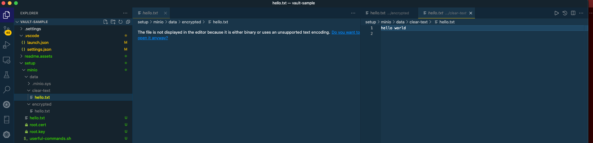
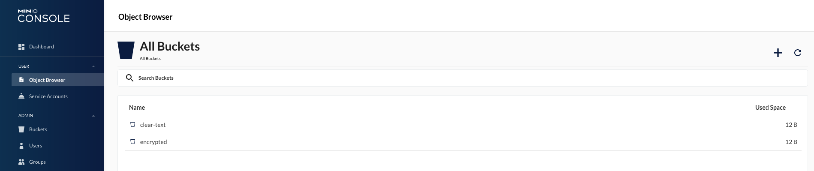
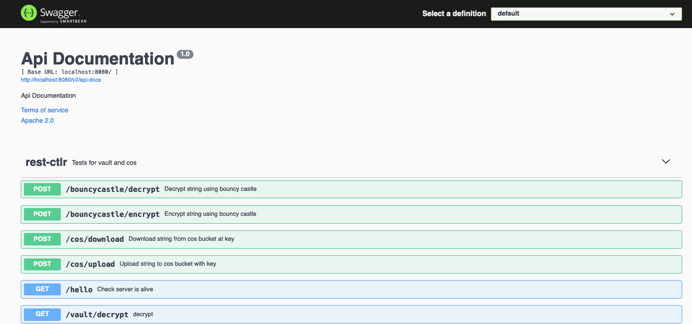
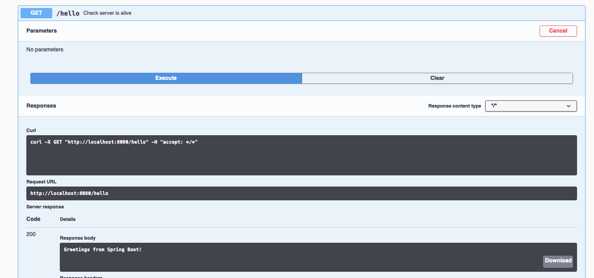
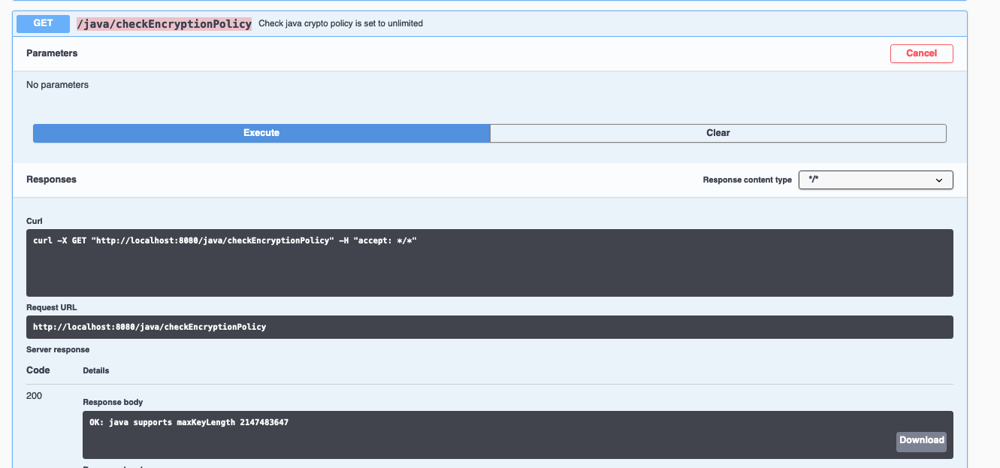

# Vault-Sample

[TOC]

## Setup

The sample application needs a target **vault** instance and a **cos** (in this case provided by **minio**.)

The project itself can be cloned from https://github.com/davidmccarty/vault-sample.

All the following steps are valid for local deployment on **macos** only.  eventually this will be extended to include packaging and deployment to a kubernetes cluster.


### 1. Clone the github project

```sh
$ git clone https://github.com/davidmccarty/vault-sample
```


### 2. Install and Cofigure Vault

1. Install vault

   ```sh
   $ brew tap hashicorp/tap
   $ brew install hashicorp/tap/vault
   ```

2. Verify installation

   ```sh
   $ vault
   Usage: vault <command> [args]
   
   Common commands:
       read        Read data and retrieves secrets
       write       Write data, configuration, and secrets
   ...
   ```

3. Create config file for vault  -  `./setup/vault/vault.hcl`

   ```yaml
    storage "raft" {
     path    = "./data"
     node_id = "node1"
   }
   
   listener "tcp" {
     address     = "127.0.0.1:8200"
     tls_disable = "true"
   }
   
   api_addr = "http://127.0.0.1:8200"
   cluster_addr = "https://127.0.0.1:8201"
   ui = true
   
   disable_mlock = true
   ```

4. From a terminal windows start vault server

   ```sh
   # go to the folder where you have the config file
   $ cd ./setup/vault
   # create a folder to store vault data
   $ mkdir ./data
   # start the vault server
   $ vault server -config=vault.hcl
   ==> Vault server configuration:
   
                Api Address: http://127.0.0.1:8200
                        Cgo: disabled
            Cluster Address: https://127.0.0.1:8201
                 Go Version: go1.15.13
                 Listener 1: tcp (addr: "127.0.0.1:8200", cluster address: "127.0.0.1:8201", max_request_duration: "1m30s", max_request_size: "33554432", tls: "disabled")
                  Log Level: info
                      Mlock: supported: false, enabled: false
              Recovery Mode: false
                    Storage: raft (HA available)
                    Version: Vault v1.7.3
                Version Sha: 5d517c864c8f10385bf65627891bc7ef55f5e827
   
   ==> Vault server started! Log data will stream in below:
   
   2021-09-15T16:56:20.263+0200 [INFO]  proxy environment: http_proxy="" https_proxy="" no_proxy=""
   ```

   **Note** - leave the terminal window open. If you close it the vault server will stop and will need to be unsealed again before the next time you use it.

5. Init  the vault with a single unseal key

   ```sh
   $ export VAULT_ADDR='http://127.0.0.1:8200'
   $ vault operator init -key-shares=1 -key-threshold=1
   Unseal Key 1: vMWCdO8YiTYPEQdNQljjGvJR4DhkT/9d3GAF2W8jgOg=
   
   Initial Root Token: s.Q106iASbvn11NXJNKjj10YCZ
   
   Vault initialized with 1 key shares and a key threshold of 1. Please securely
   distribute the key shares printed above. When the Vault is re-sealed,
   restarted, or stopped, you must supply at least 1 of these keys to unseal it
   before it can start servicing requests.
   
   Vault does not store the generated master key. Without at least 1 key to
   reconstruct the master key, Vault will remain permanently sealed!
   
   It is possible to generate new unseal keys, provided you have a quorum of
   existing unseal keys shares. See "vault operator rekey" for more information.
   ```

   Save the **Unseal Key** and **Initial Root Token** into the  `./setup/vault/useful-commands.sh` file

6. Unseal the vault using values from previous command e.g.

   ```sh
   $ vault operator unseal vMWCdO8YiTYPEQdNQljjGvJR4DhkT/9d3GAF2W8jgOg=
   Key                     Value
   ---                     -----
   Seal Type               shamir
   Initialized             true
   Sealed                  false
   Total Shares            1
   Threshold               1
   Version                 1.7.3
   Storage Type            raft
   Cluster Name            vault-cluster-1ce4ecea
   Cluster ID              dce2506e-2aae-e418-a908-989d222c1377
   HA Enabled              true
   HA Cluster              n/a
   HA Mode                 standby
   Active Node Address     <none>
   Raft Committed Index    24
   Raft Applied Index      24
   ```

7. Test cli connection

   ```sh
   # Set env variables
   $ export VAULT_TOKEN=s.Q106iASbvn11NXJNKjj10YCZ
   $ export VAULT_ADDR='http://127.0.0.1:8200'
   
   # test
   $ vault status
   Key                     Value
   ---                     -----
   Seal Type               shamir
   Initialized             true
   Sealed                  false
   Total Shares            1
   Threshold               1
   Version                 1.7.3
   Storage Type            raft
   Cluster Name            vault-cluster-1ce4ecea
   Cluster ID              dce2506e-2aae-e418-a908-989d222c1377
   HA Enabled              true
   HA Cluster              https://127.0.0.1:8201
   HA Mode                 active
   Active Since            2021-09-15T15:10:25.753484Z
   Raft Committed Index    33
   Raft Applied Index      33
   ```

8. Enable key-alue secrets engine

   ```sh
   # enable kv engine - default path will be /secret
   $ vault secrets enable -path=secret/ kv
   Success! Enabled the kv secrets engine at: secret/
   
   # create a secret
   $ vault kv put secret/test-secret hello=world
   Success! Data written to: secret/test-secret
   
   # read the secret
   $ vault kv get -format=json secret/test-secret
   {
     "request_id": "1eb5df77-bf78-4a0c-cc68-6c665936017b",
     "lease_id": "",
     "lease_duration": 2764800,
     "renewable": false,
     "data": {
       "hello": "world"
     },
     "warnings": null
   }
   
   # delete the secret
   $ vault delete secret/test-secret
   Success! Data deleted (if it existed) at: secret/test-secret
   ```

9. Enable the `transit` secrets engine by executing the following command.

   ```sh
   $ vault secrets enable transit
   Success! Enabled the transit secrets engine at: transit/
   ```

   Create a keyring for application = `vault-sample`

   ```sh
   # create keyring
   $ vault write -f transit/keys/vault-sample
   Success! Data written to: transit/keys/vault-sample
   
   # review keyring properties
   $ vault read transit/keys/vault-sample
   Key                       Value
   ---                       -----
   allow_plaintext_backup    false
   deletion_allowed          false
   derived                   false
   exportable                false
   keys                      map[1:1631720821]
   latest_version            1
   min_available_version     0
   min_decryption_version    1
   min_encryption_version    0
   name                      vault-sample
   supports_decryption       true
   supports_derivation       true
   supports_encryption       true
   supports_signing          false
   type                      aes256-gcm96
   ```

   Test you can encrypt/decrypt some text (must be encoded base64)

   ```sh
   # encrypt
   $ vault write transit/encrypt/vault-sample plaintext=$(base64 <<< "hello world")
   Key            Value
   ---            -----
   ciphertext     vault:v1:61EX22t80GUMkoX9NtvzTqbgVMudgeiv9faU95h0jeDjj9r4KkcIoA==
   key_version    1
   
   # decrypt
   $ vault write transit/decrypt/vault-sample \
        ciphertext="vault:v1:61EX22t80GUMkoX9NtvzTqbgVMudgeiv9faU95h0jeDjj9r4KkcIoA=="
   Key          Value
   ---          -----
   plaintext    aGVsbG8gd29ybGQK
   
   # decode the encded response
   $ base64 --decode <<< "aGVsbG8gd29ybGQK"
   hello world
   ```

10. Edit vault connection values in bootstrap properties file `./src/main/resources/bootstrap.yaml`

    ```yaml
    spring.cloud.vault:
    # all spring vault properties
    # ref https://docs.spring.io/spring-cloud-vault/docs/current/reference/html/#common-application-properties
      enabled: true
      token: s.Q106iASbvn11NXJNKjj10YCZ
      uri: http://127.0.0.1:8200
    
      connection-timeout: 2000
      read-timeout: 5000
    
      fail-fast: true
    
      database:
        enabled: false
    
      config.lifecycle:
        enabled: false
        min-renewal: 10s
        expiry-threshold: 20s
    ```

11. Open console and login with root token if you want to use it http://127.0.0.1:8200/ui 


### 3. Install and Config Minio

Minio will be used a substitute for IBM COS in local testing. It accepts the S3 api from Amazon for the most part.

Minio cli reference: https://docs.min.io/docs/minio-client-complete-guide.html

1. Install latest copy of minio

   ```sh
   $ brew uninstall minio
   $ brew install minio/stable/minio
   
   # install minio client
   $ brew uninstall mc
   $ brew install minio/stable/mc
   $ mc --help
   ```

2. Create a data directory in `./setup/minio` to store minio data

   ```sh
   $ cd ./setup/minio
   $ mkdir data
   ```

3. For minio to support encrypted buckets we need a KMS (like IBM COS and Key Protect). There is a demo KES keystore available on the web we can use.

   ```sh
   # download certificates for accessing KES if they are not already in the ./setup/minio folder 
   curl -sSL --tlsv1.2 \
        -O 'https://raw.githubusercontent.com/minio/kes/master/root.key' \
        -O 'https://raw.githubusercontent.com/minio/kes/master/root.cert'
   ```

4. Start minio

   ```sh
   $ export MINIO_ROOT_USER=admin
   $ export MINIO_ROOT_PASSWORD=passw0rd
   $ export MINIO_KMS_KES_ENDPOINT=https://play.min.io:7373
   $ export MINIO_KMS_KES_KEY_FILE=root.key
   $ export MINIO_KMS_KES_CERT_FILE=root.cert
   $ export MINIO_KMS_KES_KEY_NAME=my-minio-key
   $ minio server ./data --address "127.0.0.1:9000" -console-address "127.0.0.1:9001"
   
   ┏━━━━━━━━━━━━━━━━━━━━━━━━━━━━━━━━━━━━━━━━━━━━━━━━━━━━━━━━━━━━━━━━┓
   ┃ You are running an older version of MinIO released 3 weeks ago ┃
   ┃ Update: Run `mc admin update`                                  ┃
   ┗━━━━━━━━━━━━━━━━━━━━━━━━━━━━━━━━━━━━━━━━━━━━━━━━━━━━━━━━━━━━━━━━┛
   
   API: http://127.0.0.1:9000 
   RootUser: admin 
   RootPass: passw0rd 
   
   Console: http://127.0.0.1:9001 
   RootUser: admin 
   RootPass: passw0rd 
   
   Command-line: https://docs.min.io/docs/minio-client-quickstart-guide
      $ mc alias set myminio http://127.0.0.1:9000 admin passw0rd
   
   Documentation: https://docs.min.io
   ```

   **Note - ** when you kill the server process the object store data is persisted but the server config is not so remember to set the env variables and use the full command each time you restart.

5. Set a profile alias for your local minio server instance. This alias is used to qualify cli target.

   ```sh
   $ mc alias set minio-local http://127.0.0.1:9000 admin passw0rd --api s3v4
   Added `minio-local` successfully.
   ```

6. Add required buckets

   ```sh
   # make clear text bucket
   $ mc mb minio-local/clear-text
   Bucket created successfully `minio-local/clear-text`.
   
   # make encrypted bucket
   $ mc mb minio-local/encrypted
   Bucket created successfully `minio-local/encrypted`.
   $ mc encrypt set sse-s3 minio-local/encrypted
   Auto encryption configuration has been set successfully for minio-local/encrypted
   $ mc encrypt info minio-local/encrypted
   Auto encryption 'sse-s3' is enabled
   
   # list buckets
   $ mc ls minio-local
   [2021-09-15 20:48:02 CEST]     0B clear-text/
   [2021-09-15 20:50:35 CEST]     0B encrypted/
   ```

7. Upload a doc to each bucket

   ```sh
   # create a ./hello.txt file if there is not already on in the ./setup/minio folder 
   $ vi ./hello.txt
   
   # upload file to clear-text bucket
   $ mc cp hello.txt minio-local/clear-text
   hello.txt:                        12 B / 12 B  ▓▓▓▓▓▓▓▓▓▓▓▓▓▓▓▓▓▓▓▓▓▓▓▓▓▓▓▓▓▓▓▓▓▓▓▓▓▓▓▓▓▓▓▓▓▓▓▓▓▓▓▓▓▓▓▓▓▓▓▓▓▓▓▓▓▓▓▓▓▓▓▓▓▓▓▓▓▓▓▓▓▓▓▓▓▓▓▓▓▓▓▓▓▓▓▓▓▓▓▓▓▓▓▓▓▓▓▓▓▓▓▓▓▓▓▓▓▓▓▓▓▓▓  1.82 KiB/s 0s
   $ mc ls minio-local/clear-text
   [2021-09-15 21:18:52 CEST]    12B hello.txt
   $ mc stat minio-local/clear-text/hello.txt
   Name      : hello.txt
   Date      : 2021-09-15 21:18:52 CEST 
   Size      : 12 B   
   ETag      : 6f5902ac237024bdd0c176cb93063dc4 
   Type      : file 
   Metadata  :
     Content-Type: text/plain 
   
   
   $ mc cp hello.txt minio-local/encrypted
   mc cp hello.txt minio-local/encrypted
   hello.txt:                        12 B / 12 B  ▓▓▓▓▓▓▓▓▓▓▓▓▓▓▓▓▓▓▓▓▓▓▓▓▓▓▓▓▓▓▓▓▓▓▓▓▓▓▓▓▓▓▓▓▓▓▓▓▓▓▓▓▓▓▓▓▓▓▓▓▓▓▓▓▓▓▓▓▓▓▓▓▓▓▓▓▓▓▓▓▓▓▓▓▓▓▓▓▓▓▓▓▓▓▓▓▓▓▓▓▓▓▓▓▓▓▓▓▓▓▓▓▓▓▓▓▓▓▓▓▓▓▓▓▓▓▓  14 B/s 0s
   $ mc ls minio-local/encrypted
   [2021-09-15 21:19:48 CEST]    12B hello.txt
   $ mc stat minio-local/encrypted/hello.txt
   Name      : hello.txt
   Date      : 2021-09-15 21:19:48 CEST 
   Size      : 12 B   
   ETag      : 6f5902ac237024bdd0c176cb93063dc4 
   Type      : file 
   Metadata  :
     Content-Type: text/plain 
   Encrypted :
     X-Amz-Server-Side-Encryption: AES256
   ```

8. Go to the `./setup/minio/data`folder and expand the buckets. Open the `hello.txt` files and confirm that one is clear text and the other is encrypted.
   

9. Edit vault connection values in bootstrap properties file `./src/main/resources/application.yaml` to be sure they match your server

   ```yaml
   cos:
     endpoint: http://127.0.0.1:9000
     user: admin
     password: passw0rd
   ```

10. Open console at http://127.0.0.1:9001 and have a look around if you are interested
    

    

## Run application locally

The following steps describe how to run the project directly in vscode to allow debugging etc.

1. download dependencies and build target folder

   ```sh
   $ mvn clean install
   ```

2. Launch the application using the profile defined in the projects `launch.json` file. Else run the equivalent from a command line.

   ```json
   "configurations": [
           {
               "type": "java",
               "name": "vault-sample",
               "request": "launch",
               "cwd": "${workspaceFolder}",
               "console": "internalConsole",
               "mainClass": "com.garage.spring.Application",
               "projectName": "vault-sample",
               "args": ""
           }
       ]
   ```

   In the debug console, if the setup is correct you should see messages like this ...

   ```log
     .   ____          _            __ _ _
    /\\ / ___'_ __ _ _(_)_ __  __ _ \ \ \ \
   ( ( )\___ | '_ | '_| | '_ \/ _` | \ \ \ \
    \\/  ___)| |_)| | | | | || (_| |  ) ) ) )
     '  |____| .__|_| |_|_| |_\__, | / / / /
    =========|_|==============|___/=/_/_/_/
    :: Spring Boot ::        (v2.3.8.RELEASE)
   
   2021-09-15 22:34:51.736  INFO 51105 --- [           main] o.s.c.vault.config.VaultConfigTemplate   : Fetching config from Vault at: secret/application
   2021-09-15 22:34:51.956  INFO 51105 --- [           main] o.s.c.vault.config.VaultConfigTemplate   : Could not locate PropertySource: key not found
   2021-09-15 22:34:51.957  INFO 51105 --- [           main] b.c.PropertySourceBootstrapConfiguration : Located property source: [BootstrapPropertySource {name='bootstrapProperties-secret/application'}]
   2021-09-15 22:34:51.961  INFO 51105 --- [           main] com.garage.spring.Application            : No active profile set, falling back to default profiles: default
   2021-09-15 22:34:52.929  INFO 51105 --- [           main] o.s.cloud.context.scope.GenericScope     : BeanFactory id=04150484-aeac-31be-840b-b83759eebd8d
   2021-09-15 22:34:53.188  INFO 51105 --- [           main] o.s.b.w.embedded.tomcat.TomcatWebServer  : Tomcat initialized with port(s): 8080 (http)
   2021-09-15 22:34:53.199  INFO 51105 --- [           main] o.apache.catalina.core.StandardService   : Starting service [Tomcat]
   2021-09-15 22:34:53.199  INFO 51105 --- [           main] org.apache.catalina.core.StandardEngine  : Starting Servlet engine: [Apache Tomcat/9.0.41]
   2021-09-15 22:34:53.304  INFO 51105 --- [           main] o.a.c.c.C.[Tomcat].[localhost].[/]       : Initializing Spring embedded WebApplicationContext
   2021-09-15 22:34:53.305  INFO 51105 --- [           main] w.s.c.ServletWebServerApplicationContext : Root WebApplicationContext: initialization completed in 1329 ms
   2021-09-15 22:35:11.436  INFO 51105 --- [           main] o.s.b.a.e.web.EndpointLinksResolver      : Exposing 2 endpoint(s) beneath base path '/actuator'
   2021-09-15 22:35:11.611  INFO 51105 --- [           main] o.s.s.concurrent.ThreadPoolTaskExecutor  : Initializing ExecutorService 'applicationTaskExecutor'
   2021-09-15 22:35:12.006  INFO 51105 --- [           main] o.s.b.w.embedded.tomcat.TomcatWebServer  : Tomcat started on port(s): 8080 (http) with context path ''
   2021-09-15 22:35:12.211  INFO 51105 --- [           main] com.garage.spring.Application            : Started Application in 22.962 seconds (JVM running for 23.527)
   --- READY ---
   ```

3. Open the swagget at. http://localhost:8080/swagger-ui/
   

4. Test the server is OK by running the **/hello** api
   

5. Verify your java version is ok by running the **/java/checkEncryptionPolicy** api
   

   If you get an error you will need to update or patch your JRE as described below

   > If using JDK 8 updates earlier than 8u161 then you need to patch the java crytography security policies:
   >
   > 1. Download zip file here (they are already available in the project under folder `./UnlimitedJCEPolicyJDK8`)
   >    https://www.oracle.com/java/technologies/javase-jce8-downloads.html
   > 2. Overwrite files in your {JAVA_HOME}/lib/security
   >    - local_policy.jar
   >    - US_export_policy.jar
   >      Note that in Java 9, we no longer need to download the policy files package, setting the crypto.policy property to unlimited is enough:
   >
   > ```java
   > Security.setProperty("crypto.policy", "unlimited");
   > ```
   >
   > and verify in your java app using
   >
   > ```java
   > int maxKeySize = javax.crypto.Cipher.getMaxAllowedKeyLength("AES");
   > System.out.println("Max Key Size for AES : " + maxKeySize);
   > // result should be -->  Max Key Size for AES : 2147483647
   > ```


## Use Cases

Run the following test cases as required from  http://localhost:8080/swagger-ui/

### Vault: set and get a key-value secret

| API                  | Description                                                  |
| -------------------- | ------------------------------------------------------------ |
| /vault/put-kv-secret | Write a key/value secret to the vault at the specified path  |
| /vault/get-kv-secret | Read a key/value secret from the vault at the specified path |

### COS: String upload and download string

| API                  | Description                                         |
| -------------------- | --------------------------------------------------- |
| /cos/upload-string   | Upload  a string to a specific key in a bucket      |
| /cos/download-string | Download  a string for a specific key from a bucket |

###  Vault: Transit encrypt and decrypt string

| API                           | Description                                                  |
| ----------------------------- | ------------------------------------------------------------ |
| /vault/encrypt-string-transit | Use vault transit to directly encrypt a string using specified keyring |
| /vault/decrypt-string-transit | Use vault transit to directly decrypt a string using specified keyring |

### BouncyCastle: encrypt and decrypt string

| API                          | Description                                          |
| ---------------------------- | ---------------------------------------------------- |
| /bouncycastle/encrypt-string | Use bouncy castle to encrypt a string using PGP keys |
| /bouncycastle/decrypt-string | Use bouncy castle to decrypt a string using PGP keys |

### COS: upload and download string encrypted with PGP

| API                          | Description                                          |
| ---------------------------- | ---------------------------------------------------- |
| /bouncycastle/encrypt-string | Use bouncy castle to encrypt a string using PGP keys |
| /bouncycastle/decrypt-string | Use bouncy castle to decrypt a string using PGP keys |


### COS: upload and download string encrypted with transit


 ### Vault: Transit encrypt and decrypt string locally with transit datakey


### COS: upload and download string encrypted locally with transit datakey


TBD: when above is complete

1. Add support for processing files in pace of strings
2. Add logstash logigng using BNPP logstash config
3. Migrate to garage ecosystem on BNPP laptop.
